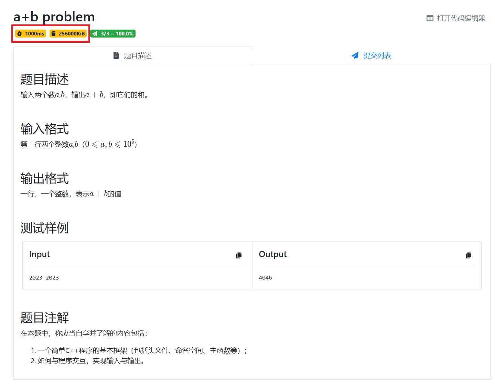
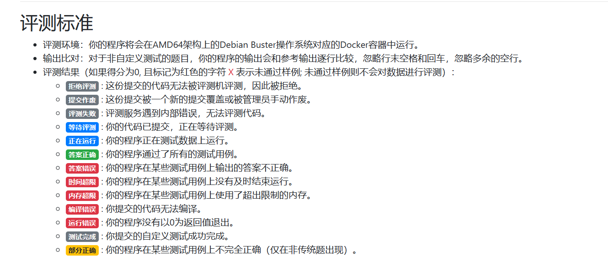
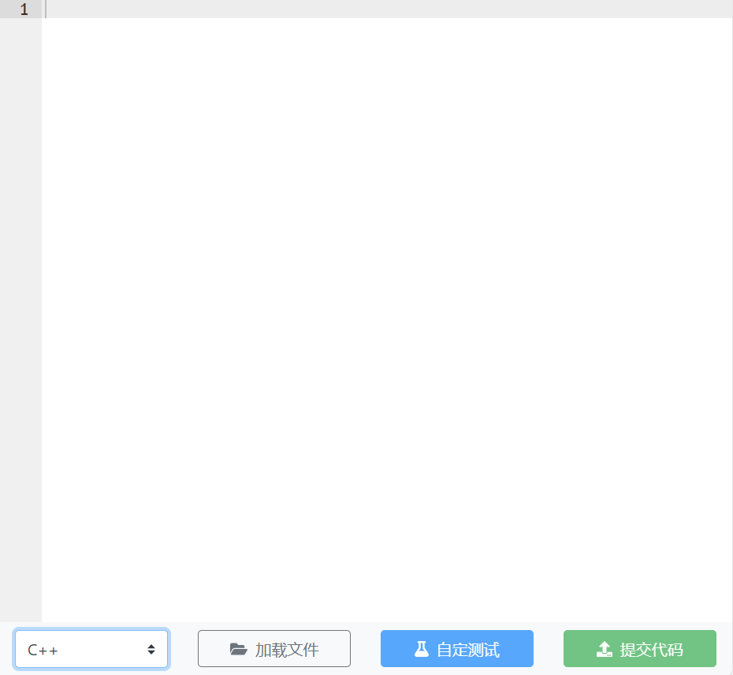

课程 OJ（psoj）用来提交和评测程序。这一课介绍读题、提交、查看结果和自定义测试。还没配置好本地环境，可以先看[第 0 课](/teaching/nju-ps/2026-fall/lectures/getting-started/)。

入口、账号和加入课程的方法按课程通知操作。

## 1. 学会读题

打开题目后，先看以下几项。

### 题目要求你做什么

从**题目描述**中找出要完成的任务。题目可能附有背景故事，读完后试着用一句话概括要求。

例如，两数相加的任务就是：读入两个整数，输出它们的和。

下面是一个题面示例。红框中的时间、内存和通过情况只是截图当时的题目信息；实际题目以 OJ 当前页面为准。

题意不清楚时，可以结合**输入格式、输出格式和测试样例**理解；仍有歧义就向助教求证，不要只凭样例猜要求。

### 输入和输出是什么格式

确认输入是一组还是多组数据，以及程序应输出什么。空格、换行、大小写都按题目要求处理，不要多打印“请输入”或“答案是”。

样例用于检查理解。例如，输入 `2 3`，输出 `5`，可以帮助你确认题目要求相加。但只通过样例，不能说明程序对其他数据也正确。

### 数据范围有多大

数据范围通常写在题目描述或输入格式中，影响数据类型和算法的选择。

例如，若两个数都在 $[0,10^5]$，普通的 `int` 足以保存它们的和；若达到 $10^{18}$，就要考虑 `long long`；若达到 $10^{100}$，这些内置整数类型都不够。

暂时不用掌握大整数算法，先养成读数据范围的习惯。

### 时间和内存限制是多少

输出正确，还要满足题目的资源限制：

- **时间限制**：程序必须在规定时间内完成。`1000 ms` 就是 1 秒。
- **内存限制**：程序使用的内存不能超过规定大小。`KiB` 是内存单位，1 KiB = 1024 字节。

不要把“1 秒能执行多少次循环”当作固定标准。循环里的操作、算法和评测机器都会影响耗时。刚开始做题时，先检查是否有死循环，数组或容器是否开得过大。

## 2. 提交程序

1. 核对题名、题号和作业截止时间。
2. 在本地保存并编译代码，测试样例，再补几组边界数据。
3. 在提交页面选择合适的 C++ 语言选项，粘贴或上传**源码**，不要提交可执行文件。
4. 确认题目要求完整程序还是指定函数，删去多余输出和仅用于本地测试的文件路径。
5. 提交后打开本次记录，查看对应代码和评测状态。

本地使用 C++20，不代表 OJ 也使用相同标准。编译器版本和参数可查 OJ 的**帮助页面**；提交时以课程支持的选项为准。

## 3. 看懂评测结果

OJ 会用测试数据运行你的程序，并检查输出和资源使用情况。测试数据通常不止题目展示的样例。

| 状态 | 含义 | 下一步 |
|---|---|---|
| 等待 / 评测中 | 还没有最终结果 | 等待后查看同一条记录 |
| AC（Accepted） | 答案正确，通过评测 | 确认作业完成状态 |
| CE（Compile Error） | 编译错误 | 从第一条编译报错查起，核对语言选项 |
| WA（Wrong Answer） | 答案错误 | 重读题意，检查格式并寻找反例 |
| RE（Runtime Error） | 运行错误 | 检查越界、非法访问、整数除以零等问题 |
| TLE（Time Limit Exceeded） | 时间超限 | 检查循环能否结束、计算量是否过大 |
| MLE（Memory Limit Exceeded） | 内存超限 | 检查数组和容器大小 |

一次提交可能存在多种错误，页面显示的状态不一定能反映全部问题。改完后重新测试，再提交。

**数组越界不一定会显示 RE。** 它也可能产生错误答案，甚至在某些输入下暂时没有表现。不要因为程序没崩溃就认为代码正确。

若页面提示“未通过样例则不会对数据进行评测”，先修正样例错误，再查看完整评测结果。

## 4. 使用自定义测试

本地能运行，交到 OJ 却出错时，可以使用平台的**自定测试**功能。

1. 在题目页面选择编程语言并输入代码。
2. 找到“自定测试”入口，填入你想检查的输入，运行测试。
3. 测试结束后打开详情，比较实际输出和预期输出；若编译失败，查看编译信息。

测试详情入口可先在“编程语言”一栏附近找，具体位置以当前页面为准。

自定义测试可以检查程序在 OJ 环境中的表现，帮助排查本地与平台的差异。例如，把 `2 3` 作为输入，检查输出是否为 `5`。

**自定义测试只检查你提供的数据，不等于正式提交通过。** 测试无误后，仍需正式提交并查看记录。

## 5. 查看提交记录和排名

修改后重新提交时，核对**题号、提交时间、代码和结果**，避免把旧记录当作新结果。

有些页面还会显示排名、提交次数和罚时。它们如何计算、是否影响课程成绩，以本学期课程说明为准。不能只凭排名判断作业是否完成。

图中的日期、姓名和分数仅为界面示例；请以自己的提交记录和课程规则为准。

找不到记录、看不到课程或无法访问页面时，保留网址、时间和页面提示，通过课程指定渠道求助。代码问题则附上源码、输入、预期输出和完整报错；提问格式可参考[第 0 课的求助模板](/teaching/nju-ps/2026-fall/lectures/getting-started/#怎样提问)。

## 试着完成一次提交

- [ ] 找到课程要求的练习题，读清输入输出和数据范围。
- [ ] 在本地通过样例，并补充自己的测试。
- [ ] 用自定义测试检查一组输入，核对结果。
- [ ] 正式提交源码，找到对应记录并理解反馈。

本文根据提供的《OJ 使用指南》整理。原文部分参考了 2021 级问题求解助教朱宇博学长的相关 slides，在此致谢。
